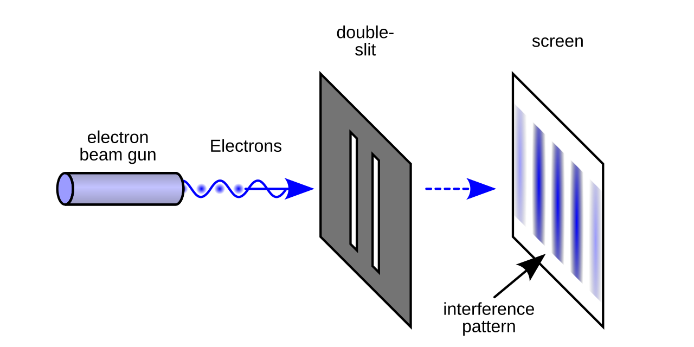

#+title: 1分钟学会量子计算（一）
#+date: Wed Sep  9 17:53:31 2026
#+author: Zi Liang
#+email: zi1415926.liang@connect.polyu.hk
#+latex_class: elegantpaper
#+filetags: ::

今天和朋友聊了一下量子计算与密码学，如此竟然发现了新的大陆。于是决定要开始理解和学习量子计算。这个系列都将是相关的笔记。

* 核心公式

量子计算的核心公式是

$$\vert{}\Psi\rangle = \sum_{x=0}^{2^N-1} c_x~\vert{}x\rangle$$

本文的目标就是理解这个公式。

** N是什么？

N是（量子）比特数。它规定了 $x$ 作为索引的总数量$2^N$.

** x是什么？或者说 $|x\rangle$ 是什么？

$|x\rangle$ 代表一个量子态。可以忽视量子这个称谓，理解之为一个态。所谓的态就是指的概率论里某个空间中的一个离散的事件。由于存在 $2^N$ 个这样的态，所以这 $2^N$ 个态其实可以被视作线性空间中的一组基，即他们构成了一个 $2^N$ 维度的线性空间。因此，可以（虽然不是必定）将这些态用最经典的one-hot vector来表达，如$[0,...,0,1,0,...,0]^T$, 即只有在对应index的维度上为1其他为0.

** $c_{x}$ 是什么？

$c_{x}$ 是对于态 $x$ 的一个系数，描述了该态以何种强度存在。

具体地， $c_{x}$ 是一个二维向量。鉴于量子力学的物理性， $c_{x}$ 可以被表达为一个复数。即，它既可以被表达为包含一个实部和一个虚部的复数，也可以被表达为包含一个模长（即该二维向量在二维空间中表达的长度）与一个相位角（即该向量与 $x_+$ 轴的夹角（更具体地，是从该轴移动到该向量的方向性时的总角度））。

由此， $c_{x}$ 的模长反映了 $x$ 索引的量子态将会以何种概率出现（平方关系），这是一个"绝对"[fn:absolute]（即单个自我比较有意义）的变量，同时收到概率论里和为1的约束，即：

$\sum_{x |}c_{x|}^{2}=1$.

与之对应， $c_{x}$ 的相位角则反映了该量子态出现的时机。这是一个相对的概念，因为角度的形成其实就是需要两条边（当没有对比物时，x+轴便是）。

[fn:absolute] 这里称绝对有些问题，因为概率和为1其实只是人类习惯下强行规定的结果。换句话说，长度的孤立且绝对存在依赖于一个封闭的数学空间定义。

** “+”（这里的加法）是什么？

即答：这里的加法就是最朴素的向量里的加法。

$\forall i, j \in [0, 2^{N}-1]$, given two reasonable complex number $\alpha, \beta$, what is $\alpha|x_{i}\rangle+\beta|x_{j}\rangle$?

We can denote it as $|\Psi\rangle_{ij}=\alpha |x_{i}\rangle+\beta|x_{j}\rangle$ .

首先可以断定所得到的这个 $|\Psi\rangle_{ij}$ 一定是也是一个量子态，即它应该共享与 $|x_{i}\rangle$ 相同的模式。换句话说，加法的结果也是一个2^N 维度的向量，该且该向量同样会拥有一个长度（即强度，幅度，概率）和一个出现的相位（即方向性）。

根据向量的加法公式，不难进行下面一番推导：

【略】

而得出

$|| |\Psi\rangle_{ij }||^{2}$ 为 $(\alpha+\beta)^2$ .

而相位为：XXXXXXX.

** $|\Psi\rangle$ 是什么？

可以注意到，一个 $|\Psi\rangle$ 其实是上述如此定义的一个2^N 空间的一个极大线性无关组进行了一个线性组合，其中系数便是c_x 所组成的向量（即坐标值们）。所以这个符号表示了该空间中的一个点，即一个向量。

如此则结束了对该公式的分析。

* 物理含义

** 薛定谔的猫

考虑一个数学上 被封闭定义的场景：某人在盒子里放了一只猫，送给了另外一个人。这个人需要打开盒子看看猫是否存活。

按照上述定义，这里的N可以等于1,即$|x\rangle$的全集为2：一个是猫活着，一个是猫死了。

那么问题来了：
1. 如何描述这个盒子在派送途中该猫的存活状态？
2. 如何描述这个盒子在打开后该猫的存活状态？
3. 如何描述这个盒子在刚刚封装完成时猫的存活状态。

他们本质上都是两个量子态的叠加态，即在这个1比特量子空间下的一个向量。后续将要被分析的类似的事件的状态也都将是如此的一个向量。

** 双缝干涉实验

一个粒子喷出器持续发射出某种具有量子性质的粒子。这些粒子首先会被一个无法通过的隔板挡住，幸运地，隔板上开出了两条缝隙，A和B,而后在隔板后制造一个收集器，来收集被发射出的粒子。

现在考虑所收集到的这些透过A而到来的粒子与透过B而到来的粒子二者之间的存在关系，以及最重要的，这个所谓的叠加态的性质。

这同样是一个极简的可以被1比特空间所描述的问题：假设状态空间包含两个基本状态，收集到的粒子穿过了缝隙A而来，以及收集到的粒子穿过缝隙B而来。那么问题是收集到的所有粒子就是上述两个状态的和事件，即要么穿过A过来，要么穿过B过来。

现在开始讨论如此的一个叠加态的性质。

首先是幅度，即叠加态向量的长度，也就是出现粒子数量的强度。

假设途径缝隙A而来的粒子的总运动距离为M，途径缝隙B而来的粒子的总运动距离为N， 速度保持v不变。

由于该粒子的运动类似于波，假设振幅为$\omega$,则其运动的角度（相位）可以被表达为

$$e^{i\theta}=e^{i (kL-\omega t)}$$ 

其中k是一个常数（与频率相关），L是波运动的距离，t是波运动的时间。

由此，两个同时出发且同频的粒子其相位上的差距可以被表达为：

$e^{i(k(M-N))}$

上式所反映的就是在该1比特量子空间中的两个向量的夹角。

当该夹角为锐角时，这两个向量的加法结果的幅值将强于单独任一向量的幅值，且在夹角为0 （即完全同相位）时达到顶峰。注意：这里并不要求距离上M与N的完全相等，只需要k(M-N)是振动频率的整数倍即可。而当调整M与N的距离使得这个夹角变化时，这个向量的加法结果将会发生变化，使得甚至出现一方向量完全为另一方所抵消的效果。

反映在实验上：当实验者调整粒子通过两个缝隙的距离时，收集器所采集到的粒子的强度将会产生明暗的变化。

这表明：
1. 粒子的波动性。
2. 距离较短的粒子在到达收集装置时，仍然会持续振动，而两束粒子的相位差，本质上便是距离带来的时间延迟。
3. 上一句的说法没有那么准确。相位差严格等于振动频率乘时间延迟，但是相位差一般大家只考虑余数（即去掉振动周期的整数倍）。即时间延迟相差证书个振动周期时，在物理效果上与同事到达完全等价。
4. 记事件A发生为E1,记事件B发生为E2, 记事件A发生或事件B发生为E3. 那么E3发生的概率，在上述的数学系统下，不一定比E1要大，也不一定比E2要大。他们的大小关系取决于E1与E2二者的方向性。

** 时间的相对性

当A与B谈论时间时，一般会默认存在一个绝对的时间参考系。

由上述讨论可知时间的相对性。即：

+ 绝对的时间坐标系是难以存在的
+ 时间差，类比于相位差，是可以绝对存在的。
+ 所谓的处在“同一时间”，或者“同时”二字，从波的角度来看不过是在谈论两个状态其振动中相位的恰好一致性。而两个处在同一时间参考系下的A和B, 不过是在说他们在类似于同频振动下所出现的冰冷的相位差。由此可以推导出：当一个人在阅读几千年前的某本书并突然领会到其中某个点事，这灵光一现状态下或许身体里的某个部分和写此书的人在意识到这个点的状态在物理意义上严格位于同一时间。即：二者就像穿过两条缝隙被打印在同一个收集器上的粒子一样，虽然有一条途径短，但是在振动中幸而碰到了后来的粒子，尽管相位差很大，但是是频率的整数倍，由此本质上属于同一时间。
+ 又可以说： *一个人可以在无数次自我的振动中在物理意义上与曾经的自己相遇。* PS.: 只要频率相同且相位合适。

** 所有的量子现象，本质上就是概率幅在空间和时间上的相对相位差。

这句话是费曼说的。

