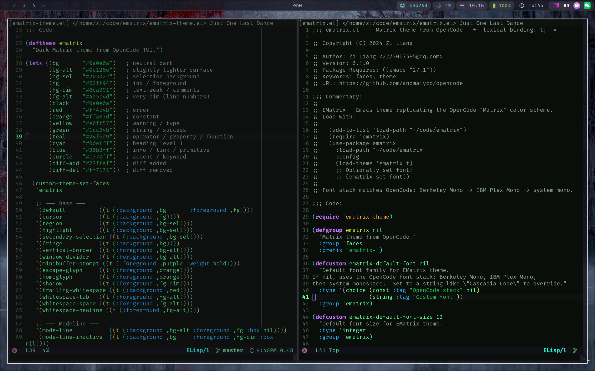
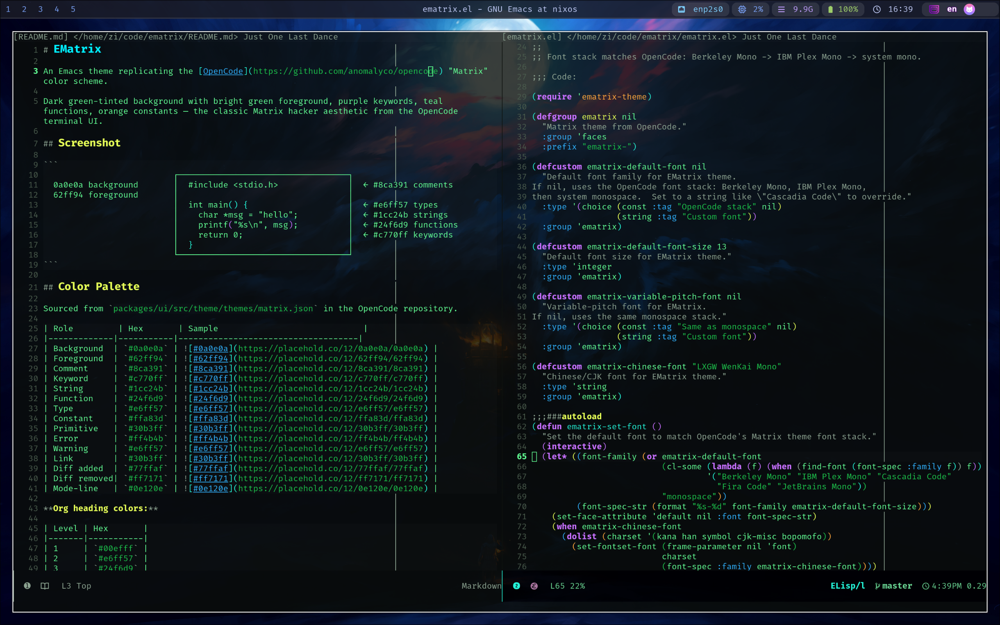

#+title: Introducing EMatrix — A Matrix-Inspired Emacs Theme
#+date: Sun May 10 17:00:00 2026
#+author: Zi Liang
#+email: zi1415926.liang@connect.polyu.hk
#+latex_class: elegantpaper
#+filetags: :emacs:theme:opensource:

EMatrix is an Emacs theme that replicates the [[https://github.com/anomalyco/opencode][OpenCode]] "Matrix" color scheme.

Dark green-tinted background with bright green foreground, purple keywords,
teal functions, orange constants — the classic Matrix hacker aesthetic from
the OpenCode terminal UI.

* Color Palette

Sourced from =packages/ui/src/theme/themes/matrix.json= in the OpenCode repository.

| Role         | Hex       |
|--------------+-----------|
| Background   | =#0a0e0a= |
| Foreground   | =#62ff94= |
| Comment      | =#8ca391= |
| Keyword      | =#c770ff= |
| String       | =#1cc24b= |
| Function     | =#24f6d9= |
| Type         | =#e6ff57= |
| Constant     | =#ffa83d= |
| Primitive    | =#30b3ff= |
| Error        | =#ff4b4b= |
| Warning      | =#e6ff57= |
| Link         | =#30b3ff= |
| Diff added   | =#77ffaf= |
| Diff removed | =#ff7171= |
| Mode-line    | =#0e120e= |

*Org heading colors:*

| Level | Hex       |
|-------+-----------|
|     1 | =#00efff= |
|     2 | =#e6ff57= |
|     3 | =#24f6d9= |
|     4 | =#c770ff= |
|     5 | =#30b3ff= |
|     6 | =#ffa83d= |
|     7 | =#1cc24b= |
|     8 | =#8ca391= |

* Why Build a "Matrix" Theme?

OpenCode is an AI-powered CLI coding agent with a distinctive green-on-dark
terminal appearance. After using OpenCode daily, I wanted the same visual
consistency inside Emacs — where I spend most of my time reading and writing
code.

The Matrix aesthetic isn't just cosmetic. The high-contrast green-on-dark
palette reduces eye strain during long sessions, and the carefully chosen
semantic colors (purple for keywords, teal for functions, orange for
constants) make code structure immediately recognizable.

* Installation

** package-vc-install (Emacs 29+)

#+begin_src emacs-lisp
(unless (package-installed-p 'ematrix)
  (package-vc-install "https://github.com/liangzid/ematrix"))
#+end_src

** use-package

#+begin_src emacs-lisp
(use-package ematrix
  :vc (:url "https://github.com/liangzid/ematrix"
        :rev :newest)
  :config
  (load-theme 'ematrix t)
  (ematrix-set-font))
#+end_src

** Manual

#+begin_src bash
git clone https://github.com/liangzid/ematrix ~/.emacs.d/elpa/ematrix
#+end_src

#+begin_src emacs-lisp
(require 'ematrix)
(load-theme 'ematrix t)
#+end_src

* Font

EMatrix matches the [[https://github.com/anomalyco/opencode/blob/dev/packages/console/app/src/style/token/font.css][OpenCode font stack]]:

| Priority | Font           | License                 |
|----------+----------------+-------------------------|
|        1 | Berkeley Mono  | Commercial ($75)        |
|        2 | IBM Plex Mono  | Open Source (SIL OFL)   |
|        3 | Cascadia Code  | Open Source (SIL OFL)   |
|        4 | Fira Code      | Open Source (SIL OFL)   |
|        5 | JetBrains Mono | Open Source (SIL OFL)   |

The first font found on your system is used automatically. On most Linux
systems, installing =fonts-ibm-plex= is the quickest way to get a close match:

#+begin_src bash
# Debian/Ubuntu
sudo apt install fonts-ibm-plex

# Arch
sudo pacman -S ttf-ibm-plex

# macOS
brew install font-ibm-plex
#+end_src

Set the font manually with =M-x ematrix-set-font=, or call it from your init:

#+begin_src emacs-lisp
(setq ematrix-default-font-size 14)
(ematrix-set-font)
#+end_src

Override with a custom font:

#+begin_src emacs-lisp
(setq ematrix-default-font "Cascadia Code")
(setq ematrix-default-font-size 13)
(ematrix-set-font)
#+end_src

The CJK font defaults to *LXGW WenKai Mono*. Change it:

#+begin_src emacs-lisp
(setq ematrix-chinese-font "Noto Serif CJK SC")
#+end_src

* Supported Packages

EMatrix provides faces for:

- *Syntax*: =font-lock=, =rainbow-delimiters=, =highlight-indentation=
- *Completion*: =company=, =vertico=, =ivy=, =marginalia=
- *Org Mode*: headings, blocks, code, links, tags, todos, agenda, checkboxes
- *Markdown*: headings, code, links, blockquotes, emphasis
- *Version Control*: =diff=, =magit=, =git-gutter=
- *UI*: =mode-line=, =doom-modeline=, =tab-bar=, =tab-line=
- *Tools*: =eglot=, =citre=, =evil=, =telega=, =hl-line=
- *Terminal*: =term=, =ansi-color=

* File Structure

#+begin_example
ematrix/
├── ematrix.el          # Package entry point, font setup, customization
└── ematrix-theme.el    # deftheme with 130+ face definitions
#+end_example

* Credits

Color scheme sourced from [[https://github.com/anomalyco/opencode][OpenCode]] by AnomalyCo, used under the MIT license.

The theme is at [[https://github.com/liangzid/ematrix][github.com/liangzid/ematrix]].

* License

MIT
