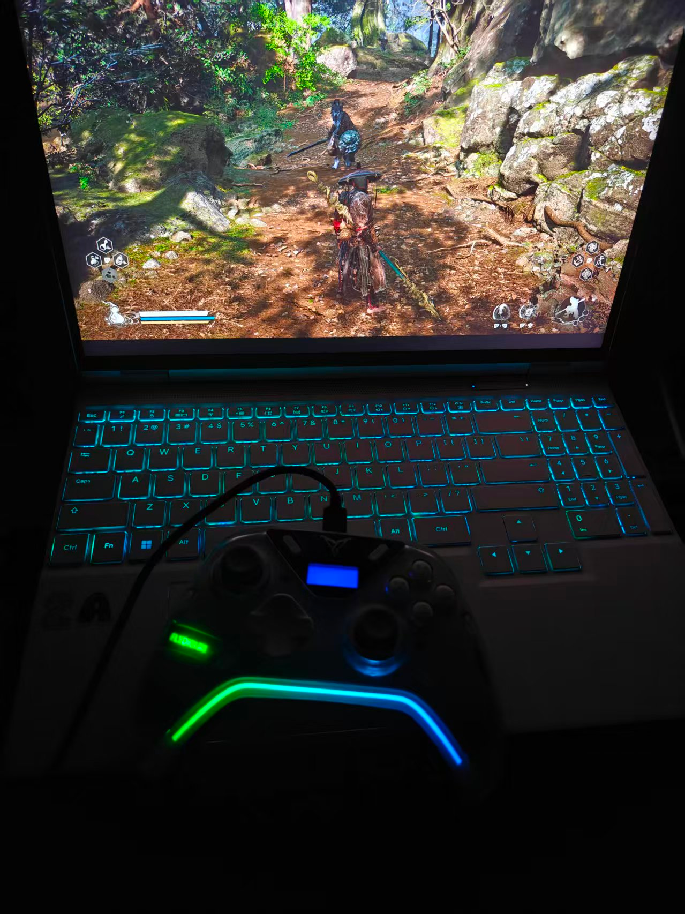
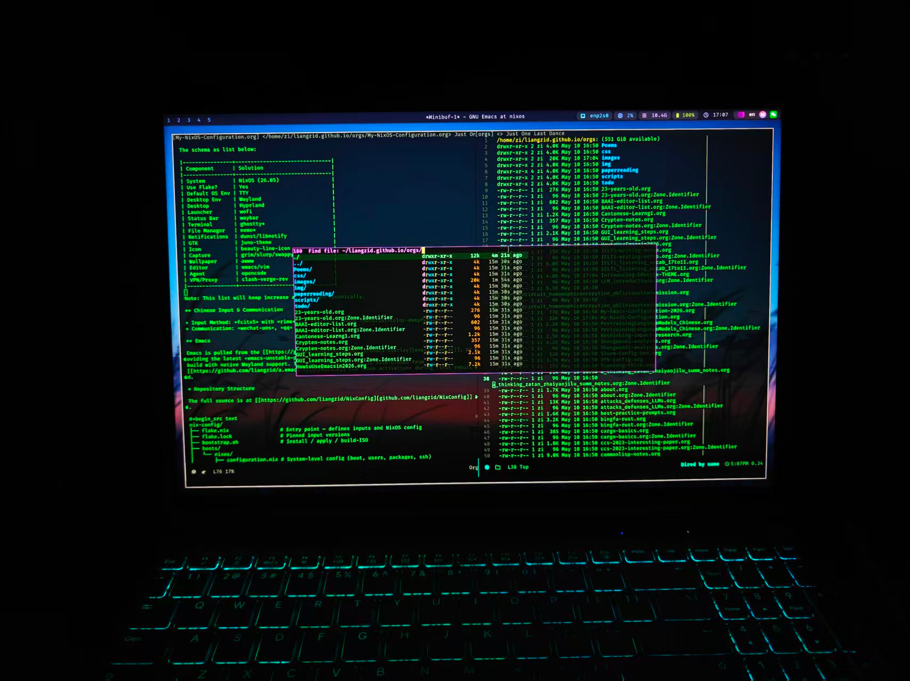
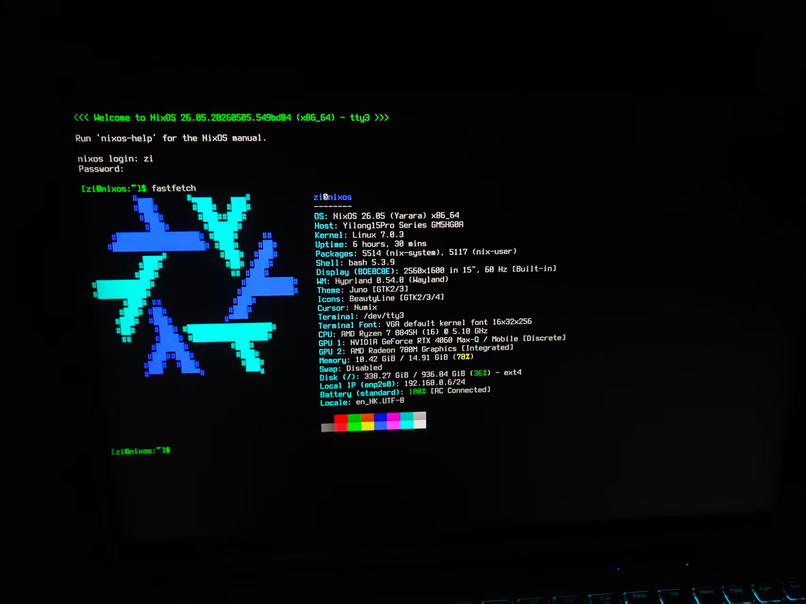
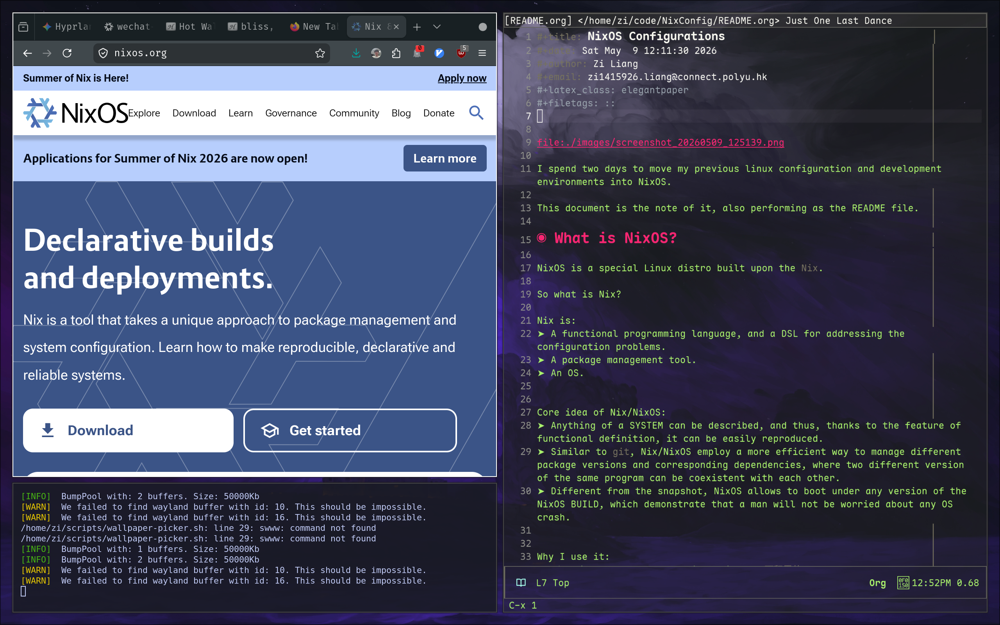
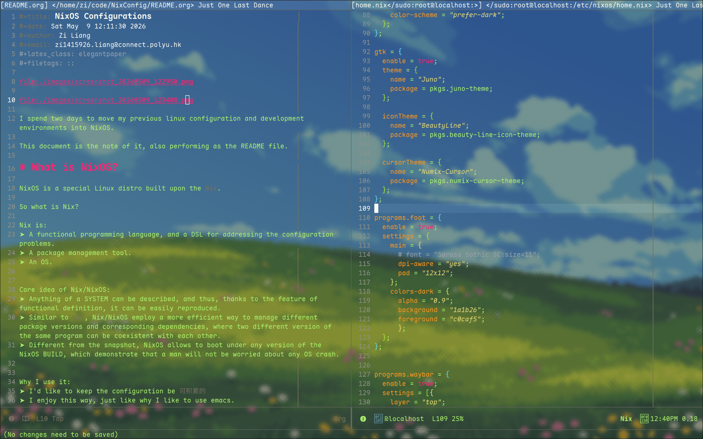
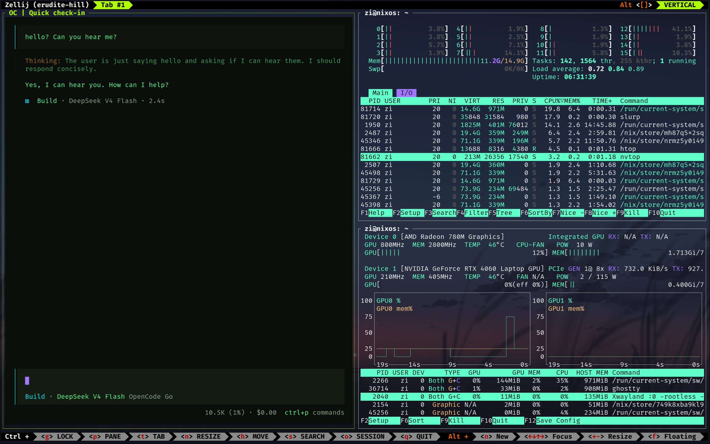

#+title: My NixOS Configuration!
#+date: Sun May 10 16:51:14 2026
#+author: Zi Liang
#+email: zi1415926.liang@connect.polyu.hk
#+latex_class: elegantpaper
#+filetags: ::

A reproducible, modular NixOS desktop configuration featuring Hyprland,
Ghostty, Emacs, and a complete development toolchain — all managed via
flake and home-manager.

[[file:./images/screenshot_20260509_125139.png]]

[[file:./images/screenshot_20260509_125317.png]]

[[file:./images/screenshot_20260509_125943.png]]

I spent two days to move my previous linux configuration and development
environments into NixOS. This document records the setup and serves as a
reference for anyone interested in NixOS-based desktop configuration.

* What is NixOS?

NixOS is a special Linux distro built upon the =Nix=.

So what is Nix?

Nix is:
+ A functional programming language, and a DSL for addressing the configuration problems.
+ A package management tool.
+ An OS.

Core idea of Nix/NixOS:
+ Anything of a SYSTEM can be described, and thus, thanks to the feature of functional definition, it can be easily reproduced.
+ Similar to =git=, Nix/NixOS employ a more efficient way to manage different package versions and corresponding dependencies, where two different version of the same program can be coexistent with each other.
+ Different from the snapshot, NixOS allows to boot under any version of the NixOS BUILD, which demonstrate that a man will not be worried about any OS crash.

Why I use it:
+ I'd like to keep the configuration be =可积累的=
+ I enjoy this way, just like why I like to use emacs.

* What This Configuration Contains?

This configuration contains a *minimal* configuration of my new desktop environment.

It is a TTY environment by default, BUT providing a very beautiful and
robust and convenient DESKTOP development environment.

The schema as list below:

|----------------+-------------------------------|
| Component      | Solution                      |
|----------------+-------------------------------|
| System         | NixOS (26.05)                 |
| Use Flake?     | Yes                           |
| Default OS Env | TTY                           |
| Desktop Env    | Wayland                       |
| Desktop        | Hyprland                      |
| Launcher       | wofi                          |
| Status Bar     | waybar                        |
| Terminal       | ghostty*                      |
| File Manager   | nemo*                         |
| Notifications  | dunst/libnotify               |
| GTK            | juno-theme                    |
| Icon           | beauty-line-icon              |
| Capture        | grim/slurp/swappy             |
| Wallpaper      | awww                          |
| Editor         | emacs/vim                     |
| Agent          | opencode                      |
| VPN/Proxy      | clash-verge-rev               |
|----------------+-------------------------------|

Note: This list will keep increase and changed dynamically.

** Chinese Input & Communication

+ Input Method: =fcitx5= with =rime= and =pinyin=, theme =Material-Color-deepPurple=
+ Communication: =wechat-uos=, =qq=

** Emacs

Emacs is pulled from the [[https://github.com/nix-community/emacs-overlay][emacs-overlay]], providing the latest =emacs-unstable-pgtk=
build with native Wayland support. The Emacs configuration is auto-cloned from
[[https://github.com/liangzid/a.emacs.d][a.emacs.d]] via =home.activation= during first rebuild.

* Repository Structure

The full source is at [[https://github.com/liangzid/NixConfig][github.com/liangzid/NixConfig]].

#+begin_src text
nix-config/
├── flake.nix                 # Entry point — defines inputs and NixOS config
├── flake.lock                # Pinned input versions
├── bootstrap.sh              # Install / apply / build-ISO
├── hosts/
│   └── nixos/
│       ├── configuration.nix # System-level config (boot, users, packages, ssh)
│       ├── hardware-configuration.nix
│       └── home.nix          # User-level config (packages, env, dotfiles, ssh)
├── modules/
│   ├── system/               # Reusable system modules
│   │   ├── hyprland.nix      # Hyprland WM with xwayland
│   │   ├── nvidia.nix        # NVIDIA GPU + modesetting
│   │   ├── fonts.nix         # CJK + nerd fonts
│   │   ├── input-method.nix  # fcitx5 + rime + cloudpinyin + theme
│   │   ├── pipewire.nix      # Audio: pipewire + alsa + pulse
│   │   ├── portal.nix        # XDG desktop portal for Wayland
│   │   └── kanata.nix        # CapsLock → Control remap
│   └── home/                 # Reusable home-manager modules
│       ├── emacs.nix          # Emacs + vterm
│       ├── waybar.nix        # Status bar with tokyonight theme
│       └── gtk.nix           # GTK theme + dark mode
└── dotfiles/                 # Configuration files managed by home-manager
    ├── hypr/hyprland.conf    # Hyprland keybindings + autostart
    ├── wofi/{config,style.css}
    ├── ghostty/config        # Terminal with Emacs-style keybinds + Aura theme
    ├── clash/merge-hk.yaml   # GFW bypass rules (Hong Kong mode)
    ├── clash/merge-cn.yaml   # GFW bypass rules (Mainland mode)
    └── fcitx5/{classicui,pinyin}.conf  # Input method theming & behaviour
#+end_src

* Getting Started

** On an Existing NixOS Machine

#+begin_src bash
  git clone https://github.com/liangzid/nix-config.git ~/code/NixConfig
  sudo nixos-rebuild switch --flake ~/code/NixConfig#nixos
#+end_src

** Fresh Install (from NixOS ISO)

#+begin_src bash
  # 1. Partition disks and mount to /mnt
  # 2. Run the installer
  ./bootstrap.sh install
#+end_src

This will generate a hardware config for the new machine, clone the repo,
and run =nixos-install --flake=.

** Tip: Quick Rebuild

Use the =update= alias:
#+begin_src bash
  update
#+end_src
Remember to =git add= any newly created files before rebuilding, as the flake
requires all referenced files to be Git-tracked.

* Hyprland Keybindings

| Key                     | Action                           |
|-------------------------+----------------------------------|
| =Super + arrows=        | Move focus                       |
| =Super + Tab=           | Cycle windows                    |
| =Super + 1-0=           | Switch to workspace 1-10         |
| =Super + Shift + 1-0=   | Move window to workspace 1-10    |
| =Super + K=             | Kill active window               |
| =Super + V=             | Toggle floating                  |
| =Super + F=             | Toggle fullscreen                |
| =Super + R=             | Enter resize mode (arrows / HJKL)|
| =Super + T=             | Open terminal (=ghostty=)        |
| =Super + X=             | Open launcher (=wofi=)           |
| =Super + E=             | Open file manager (=nemo=)       |
| =Super + L=             | Lock screen (=swaylock=)         |
| =Super + Q=             | Quit Hyprland                    |
| =Super + Alt + arrows=  | Move window                      |
| =Ctrl + Alt + T=        | Open terminal (alternative)      |
| =Print=                 | Screenshot region → annotate     |
| =Ctrl + Print=          | Fullscreen screenshot → clipboard|

* Ghostty Keybindings

Ghostty is the primary terminal emulator, configured with Emacs-style
keybinding conventions.

| Key                     | Action                           |
|-------------------------+----------------------------------|
| =C-x 2=                 | Split horizontally (down)        |
| =C-x 3=                 | Split vertically (right)         |
| =C-x 1=                 | Zoom (maximize) current split    |
| =C-x 0=                 | Close current split              |
| =C-x o=                 | Next split (other-window)        |
| =C-x k=                 | Close current split              |
| =C-x b=                 | Tab overview                     |
| =Alt + 1-9=             | Jump to tab 1-9                  |
| =Ctrl+Shift+T= / =C-t=  | New tab                          |
| =Ctrl+Shift+W=          | Close surface                    |
| =Ctrl+Shift+Enter=      | New split (auto direction)       |
| =Ctrl+Shift+,=           | Reload config                    |

Ghostty uses the =Aura= theme with =background-opacity = 0.8= and
=term = xterm-256color= for full compatibility when SSH-ing to remote servers.

* Laboratory Server Access

All SSH servers are defined in the home.nix configuration. Each server has two aliases:

+ =gsXX= / =csX= — direct connection
+ =gsXXo= / =csXo= — via bastion (jump host: =is1.astaple.com=)

#+begin_src bash
  ssh gs14       # direct
  ssh gs14o      # via jump host
  ssh cs1        # direct
  ssh cs2o       # via jump host
#+end_src

SSH keepalive (=ServerAliveInterval 60=) prevents idle disconnection,
and =AddKeysToAgent yes= caches key passphrases in memory.

* GFW Bypass (Clash Verge Rev)

[[https://github.com/clash-verge-rev/clash-verge-rev][clash-verge-rev]] is installed for proxy management.
Two merge configs are provided for switching between regions:

- =merge-hk.yaml=: most traffic → DIRECT, only AI services (ChatGPT, OpenAI,
  Anthropic) → Proxy
- =merge-cn.yaml=: subscription handles default routing, with additional
  rules for lab servers and AI services

To switch: Profiles → subscription → Edit Info → Merge → point to the desired yaml.

* Input Method

Fcitx5 is configured with:
+ Chinese addons (pinyin + cloud pinyin)
+ Rime support
+ Theme: =Material-Color-deepPurple=
+ Shuangpin: Ziranma profile
+ Complete pinyin.conf managed by home-manager

* Keyboard Remap

=CapsLock= is remapped to =Control= via [[https://github.com/jtroo/kanata][kanata]].

* System Aliases

| Alias       | Command                                          |
|-------------+---------------------------------------------------|
| =enw=       | =emacs -nw=                                      |
| =ec=        | =emacsclient=                                    |
| =update=    | =sudo nixos-rebuild switch --flake ~/code/NixConfig#nixos= |
| =latexmain= | =latexmk --pdflatex main.tex=                    |
| =gui=       | =start-hyprland=                                 |

* Notes

** Super+L and logind

Systemd-logind intercepts =Super+L= by default. This config adds
=services.logind.settings= to ignore those hardware keys and let Hyprland
handle them.

** Swaylock PAM

=Swaylock= is configured as a PAM service (=security.pam.services.swaylock=)
so it can unlock the screen without requiring a password policy override.

** Steam

Steam is enabled at the system level: =programs.steam.enable = true=.
This automatically installs all required 32-bit libraries and the Steam
package itself.

** Ghostty Terminfo

Ghostty's terminfo is made available via
=environment.sessionVariables.TERMINFO_DIRS=. Additionally, =term = xterm-256color=
in the Ghostty config ensures full compatibility when SSH-ing to remote
servers that lack the Ghostty terminfo entry.

** Unfree Packages

=nixpkgs.config.allowUnfreePredicate= whitelists only the unfree packages
actually in use (NVIDIA drivers, Steam, Discord, VS Code, WeChat, QQ, etc.).

** Git Requirement

The flake requires all referenced files to be tracked by Git. Before
rebuilding, run:
#+begin_src bash
  git -C ~/code/NixConfig add -A
#+end_src
